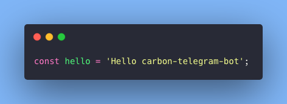
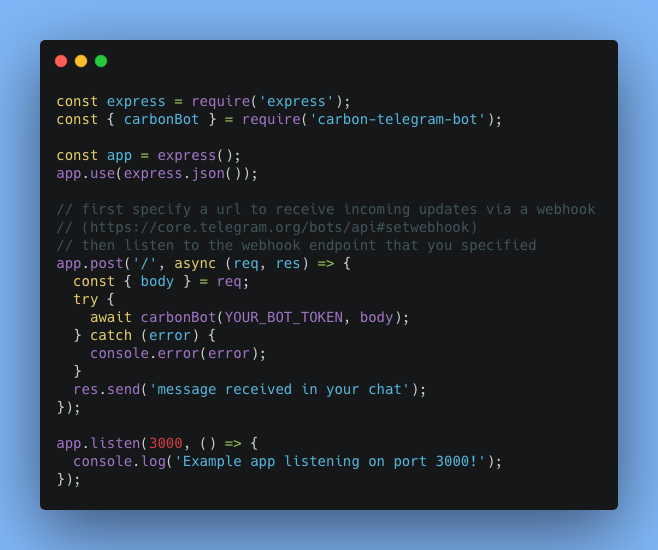
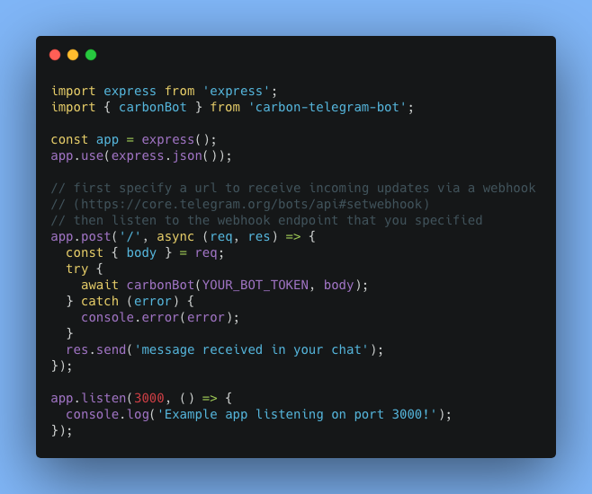

# carbon-telegram-bot



## Introduction

[Telegram](https://telegram.org) Bots can handle messages automatically.
Users can interact with bots by sending messages in private or group chats that .

This package is intended to listen to [Update messages](https://core.telegram.org/bots/api#update) received by your bot's server **/post** **webhook**. Then `carbon-telegram-bot` will listen to `pre-formatted` or `code` markdown and reply the chat message with a beautiful [Carbon](http://carbon.now.sh) code snippet.

### Installation

```
$ npm install carbon-telegram-bot
```

or using `yarn`:

```
$ yarn add carbon-telegram-bot
```

### Triggering the bot

**carbon-telegram-bot** will always trigger when a message is sent in chat fomarted as `code` or `pre-formated` text as follows:

````
Markdown:
`code` and ```pre-formatted```
````

More information: [Telegram markdown style](https://core.telegram.org/bots/api#markdownv2-style)

### Implementation Examples

```js
const express = require('express');
const { carbonBot } = require('carbon-telegram-bot');

const app = express();
app.use(express.json());

// first specify a url to receive incoming updates via a webhook
// (https://core.telegram.org/bots/api#setwebhook)
// then listen to the webhook endpoint that you specified
app.post('/', async (req, res) => {
  const { body } = req;
  try {
    await carbonBot(YOUR_BOT_TOKEN, body);
  } catch (error) {
    console.error(error);
  }
  res.send('message received in your chat');
});

app.listen(3000, () => {
  console.log('Example app listening on port 3000!');
});
```

> Code snippet generated with above example:



---

```js
import express from 'express';
import { carbonBot } from 'carbon-telegram-bot';

const app = express();
app.use(express.json());

// first specify a url to receive incoming updates via a webhook
// (https://core.telegram.org/bots/api#setwebhook)
// then listen to the webhook endpoint that you specified
app.post('/', async (req, res) => {
  const { body } = req;
  try {
    await carbonBot(YOUR_BOT_TOKEN, body);
  } catch (error) {
    console.error(error);
  }
  res.send('message received in your chat');
});

app.listen(3000, () => {
  console.log('Example app listening on port 3000!');
});
```

> Code snippet generated with above example:



---

Contributions are welcome. Just send me a PR.
